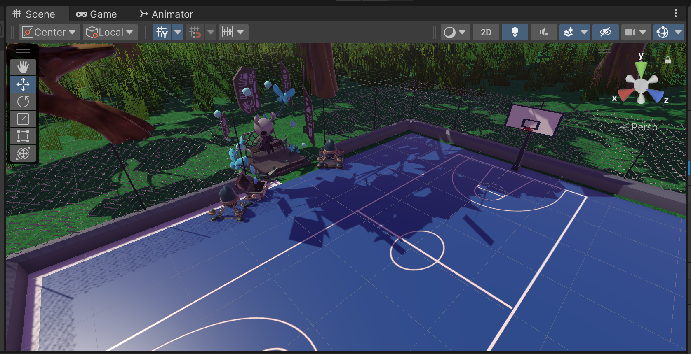

# Unity Basketball Game

## Description

This is a simple basketball game built using Unity. The objective of the game is to score as many points as possible by shooting the basketball into the hoop. The player can control the direction and power of the shot, making it a fun and challenging experience.

## Features

- Intuitive and responsive player controls.
- Realistic physics for the basketball movement and interaction.
- Scoring system with visual feedback.
- Spawned basketballs that fly upwards and forward upon instantiation.

## Demo

[Link to Gameplay Video](https://www.youtube.com/watch?v=YOUR_VIDEO_ID_HERE)

## How to Play

1. Clone or download the repository.
2. Open the project in Unity (version 2022.3.1f1 or later).
3. Find the scene named "MainVrScene" in the `Scenes` folder and open it.
4. Press the play button in Unity to start the game.
5. Use a VR headset to aim and shoot the basketballs.
6. Try to score as many points as you can!

## Screenshots

## Dependencies

- Unity 2022.3.1f1 (download from [Unity website](https://unity.com/))
- (Any other external libraries or assets used in the project)

## Contributing

Contributions are welcome! If you find a bug or have any improvements, feel free to open an issue or submit a pull request.

## License

This project is licensed under the [MIT License](LICENSE).

## Credits

- Developed by [Captain Dany](https://github.com/CaptDany/), [Barucq Juárez](https://github.com/Barucq), [SpookyDeimos](https://github.com/SpookyDeimos/), [Erick Marmolejo](https://github.com/TsunamicStone6) and Gael Luna. 
